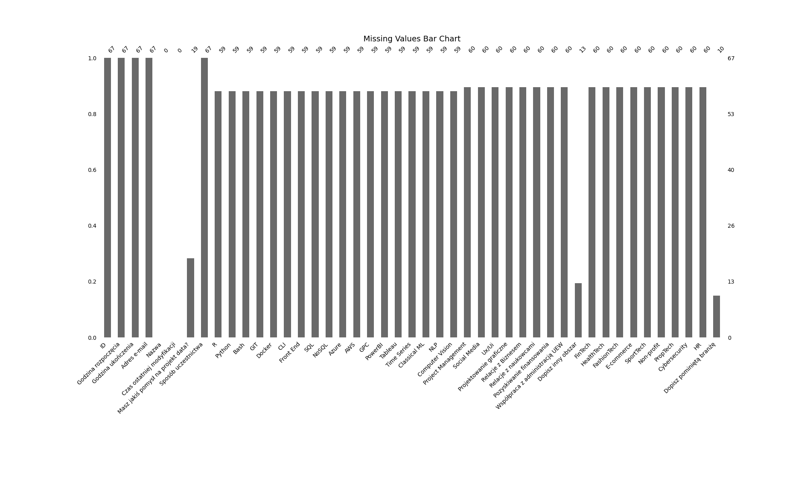
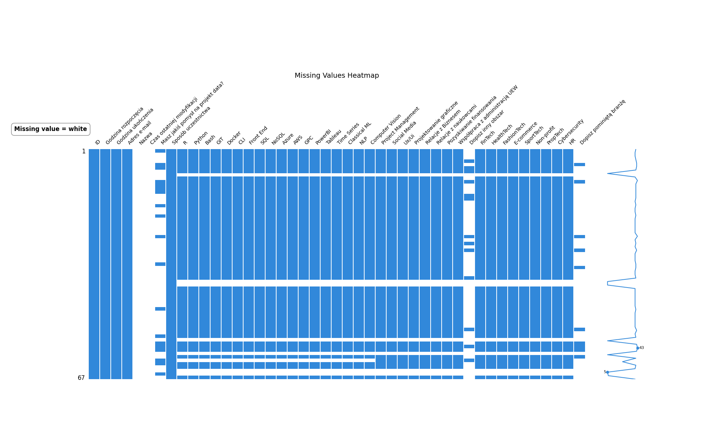
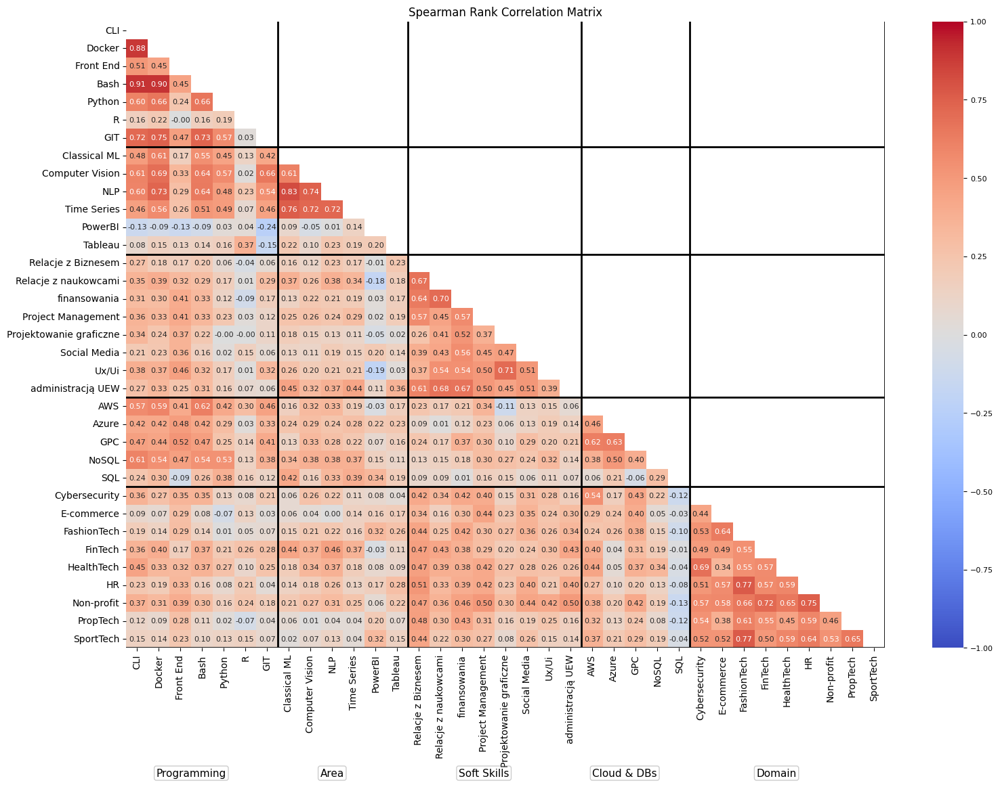
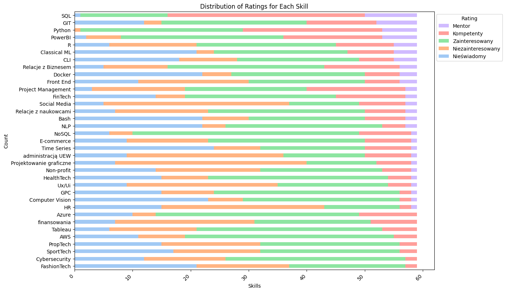

<h1 style="border: none; padding: 0; margin: 0;">Data Mining HR Analytics</h1>

---

<h2 style="border: none; padding: 0; margin: 0;">↘️ Opis projektu</h2>

---

<strong>Projekt Grupowania Studentów</strong> ma na celu wykorzystanie <strong>Nienazdorowanego Uczenia Maszynowego</strong> do grupowania respondentów na podstawie zadeklarowanych w ankiecie umiejętności Data Science.
Celem modelowania jest znalezienie optymalnej liczby grup (klastrów) respondentów, co z kolei ma wspomagać proces przypisywania ludzi do projektów pod kątem potrzeb projektowych tzn. przypisanie uczestników do grup z podziałem na:

* Mentor, 
* Osoby średniozaawansowane, 
* Początkujących (zainteresowanych) nauką,
* Niezainteresowanych danym narzędziem

 

## ⏬ Spis treści ##

- [⏬ Spis treści](#-spis-treści)
- [🔢 Opis danych](#-opis-danych)
- [📉 Wizualizacja Danych](#-wizualizacja-danych)
  - [▶️ Liczba brakujących danych](#️-liczba-brakujących-danych)
  - [▶️ Mapa brakujących danych](#️-mapa-brakujących-danych)
  - [▶️ Macierz korelacji Spearmana](#️-macierz-korelacji-spearmana)
  - [▶️ Dystrybucja umiejętności](#️-dystrybucja-umiejętności)
  - [↪️ Wstępne wnioski z eksploracji danych](#️-wstępne-wnioski-z-eksploracji-danych)

## 🔢 Opis danych ## 

System oparty na uczeniu maszynowym będzie analizował kompetencje studentów oraz odpowiedzi z ankiety, aby zalecać optymalne składy grupowe oparte na ich zdolnościach i preferencjach. Ankieta zawierała pytania w skali od 0 do 4 o:
  * umiejętności programowania w R, Python, Bash,
  * znajomość Version Control w GIT
  * znajomość CLI (Bash, PowerShell, CMD)
  * umiejętności projektowania Front Endu (HTML, JavaScript, CSS)
  * znajomość Baz Danych (SQL i inne)
  * znajomość Chmur (Azure, AWS, GPC)
  * umiejętności wizualizacji danych (PowerBI, Tableau)
  * doświadczenie w obszarach Time Series, Classical ML, NLP oraz Computer Vision
  * inne (m. in. Zarządzanie projektowe, Social Media, Ux/Ui, Projektowanie graficzne)

 

    <a href="#⏬-spis-treści" style="color: grey;">wróć na górę</a>

## 📉 Wizualizacja Danych ##
### ▶️ Liczba brakujących danych ###

Na początku przeglądu danych, przeprowadziliśmy analizę brakujących wartości. Poniżej znajduje się wykres słupkowy (bar chart), który prezentuje liczbę brakujących wartości w poszczególnych kolumnach.
Z analizy wykresu wynika, że w dwóch kolumnach nie ma żadnych danych. Z tego powodu można te kolumny całkowicie usunąć z dalszej analizy.

    <a href="#⏬-spis-treści" style="color: grey;">wróć na górę</a>

 

  

### ▶️ Mapa brakujących danych ###

Następny wykres ukazuje dokładną mapę odpowiedziAnaliza brakujących danych wskazuje, że niektóre osoby przerwały wypełnianie ankiety po odpowiedzi na pytanie o preferowany sposób uczestnictwa, zostając być biernymi obserwatorami. Z tego powodu odrzucamy tych respondentów, ponieważ interesują nas jedynie aktywni uczestnicy. Dzięki temu możemy skupić się na osobach, które wyraziły chęć aktywnego uczestnictwa, co pozwala nam lepiej dostosować nasze rozwiązania.

    <a href="#⏬-spis-treści" style="color: grey;">wróć na górę</a>

 

  

### ▶️ Macierz korelacji Spearmana ###
Kolejną wizualizacją jest macierz korelacji Spearmana. Umożliwia on identyfikację silnych i słabych powiązań między różnymi umiejętnościami i dziedzinami. Wysokie wartości dodatnie sugerują, że osoby posiadające jedną umiejętność często posiadają również drugą, podczas gdy wysokie wartości ujemne sugerują, że posiadanie jednej umiejętności wyklucza posiadanie drugiej. Brak korelacji sugeruje, że zmienne są od siebie niezależne.

    <a href="#⏬-spis-treści" style="color: grey;">wróć na górę</a>

 

  

Umiejętnościami najbardziej skorelowanymi są:

* Bash i Python: 0.66. 
* GIT i Bash: 0.73. 
* Docker i GIT: 0.75. 
* CLI i Bash: 0.91 - najwyższa korelacja. 
* NoSQL i SQL: 0.54. 
* NLP i Classical ML: 0.83. 

### ▶️ Dystrybucja umiejętności ###
Analizując wyniki ankiety, można zauważyć, że umiejętności związane z SQL cieszą się największym uznaniem wśród respondentów. Następnie na liście znajdują się GIT oraz Python, co jest zgodne z oczekiwaniami w grupie zajmującej się projektami związanymi z AI i machine learningiem, gdzie Python odgrywa kluczową rolę jako główny język programowania. 

Dodatkowo, najmniejsze zainteresowanie wśród ankietowanych wywołują tematy związane z HR, administracją oraz projektowaniem graficznym. Te obszary są najmniej znane lub najmniej preferowane przez uczestników ankiety. 

Szczególną uwagę zwracają także umiejętności, które są najmniej znane wśród respondentów, takie jak Time series, Docker oraz Computer vision. Warto zauważyć, że mimo ich niskiego poziomu znajomości, mogą one okazać się niezwykle użyteczne przy realizacji niektórych projektów, zwłaszcza w kontekście zadań związanych z analizą szeregów czasowych, wirtualizacją aplikacji czy rozpoznawaniem obrazów. 

    <a href="#⏬-spis-treści" style="color: grey;">wróć na górę</a>

 

  

### ↪️ Wstępne wnioski z eksploracji danych ###

  * Najwyższe korelacje odpowiedzi mają: Docker - Bash- CLI, NLP - Classical ML, FashionTech - Sport-Tech, HR - Non-profit
  * Najniższe korelacje miała para PowerBI - GIT.

  * SQL, GIT, Python i PowerBI mają najwięcej osób, które uznają się za mentorów. Mentorów nie ma dla Azure, finansowania, Tableau, AWS, PropTech, SportTech, Cybersecurity i FashionTech.
  * Obszary z największą osobą chetnych do ich nauki są: NoSQL, AWS, Azure, Tableu, GPC, HealthTech, ale warto zaznaczyc, że każdy obszar ma znaczący udział osób, które chcą się go uczyć.
  * Obszarami z największą ilością osób, które nie słyszały o danym obszarze są TimeSeries, Computer Vision, Docker, Bash, NLP, Classical ML i Fashiontech. Każda z pytanych osób słyszała o Pythonie.
  * Największym udziałem osób niezainterestowanych odznaczyły się Projektowanie graficzne, Social Media, HR, administracja UEW, Ux/UI, finansowanie, Front-End.

    <a href="#⏬-spis-treści" style="color: grey;">wróć na górę</a>

<h2>↪️ Rezultat</h2>

