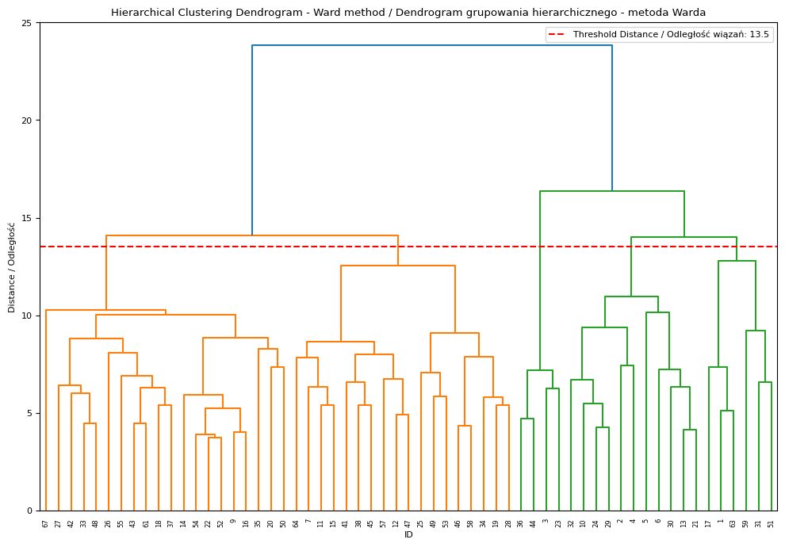
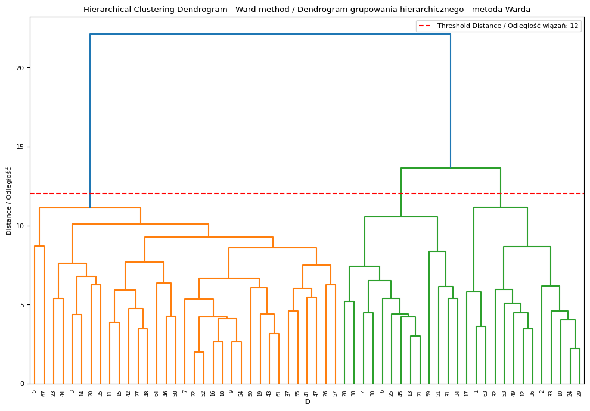
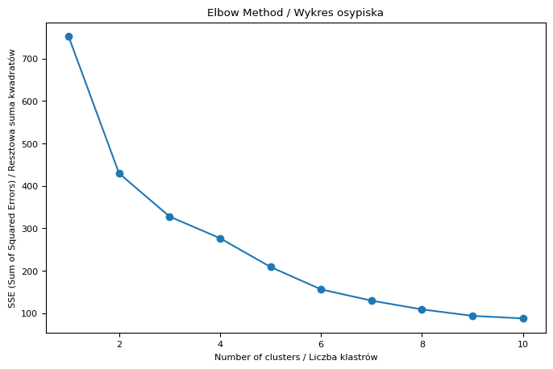
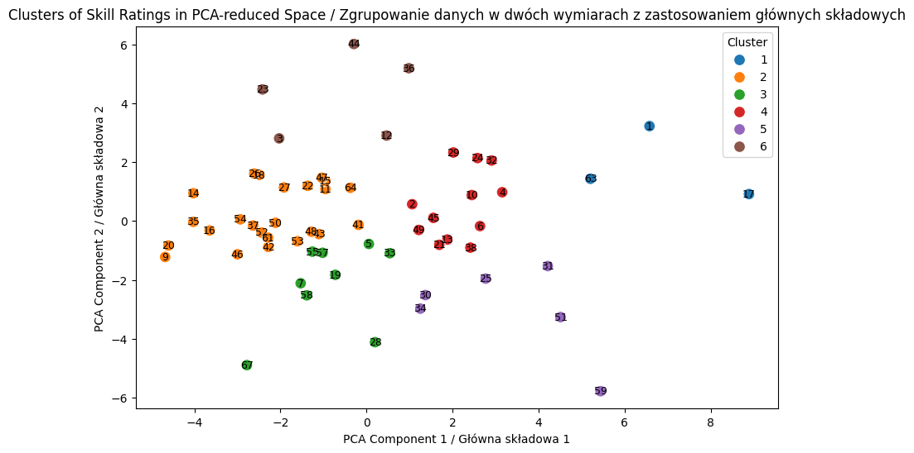
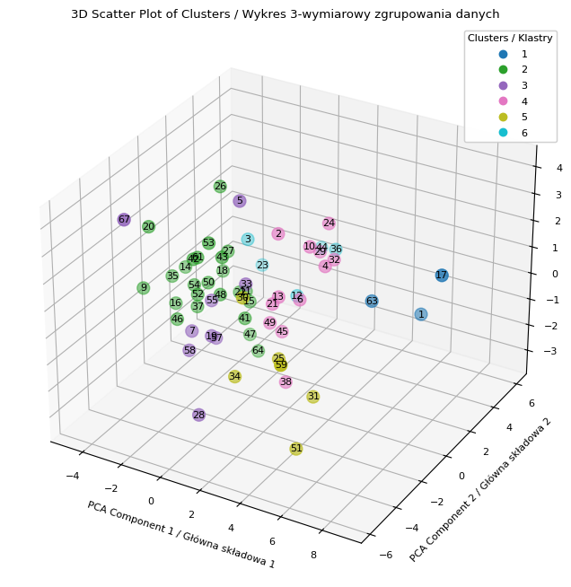
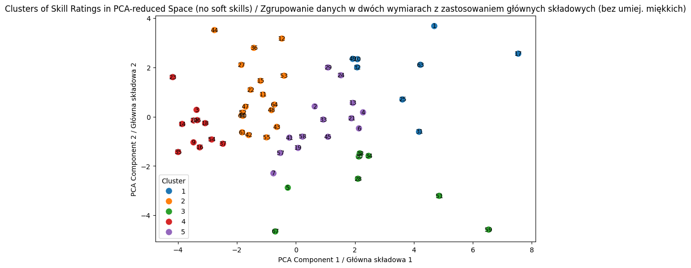
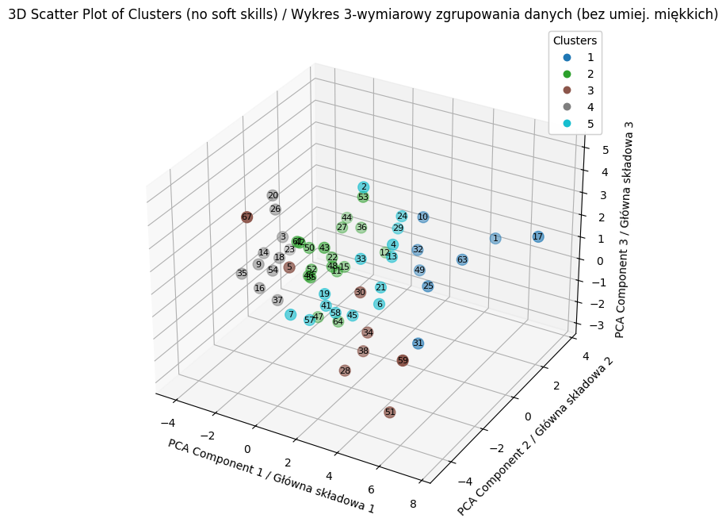

<h1 style="border: none; padding: 0; margin: 0;">Data Mining HR Analytics</h1>

---

<h2 style="border: none; padding: 0; margin: 0;">↘️ Opis projektu</h2>

---

<strong>Projekt Grupowania Studentów</strong> ma na celu wykorzystanie <strong>Nienazdorowanego Uczenia Maszynowego</strong> do grupowania respondentów na podstawie zadeklarowanych w ankiecie umiejętności Data Science.
Celem modelowania jest znalezienie optymalnej liczby grup (klastrów) respondentów, co z kolei ma wspomagać proces przypisywania ludzi do projektów pod kątem potrzeb projektowych tzn. przypisanie uczestników do grup z podziałem na:

* Mentor, 
* Osoby średniozaawansowane, 
* Początkujących (zainteresowanych) nauką,
* Niezainteresowanych danym narzędziem
* Nieświadomych istnienia narzędzia

 

## ⏬ Spis treści ##

- [⏬ Spis treści](#-spis-treści)
- [🔢 Opis danych](#-opis-danych)
- [📉 Eksploracja danych](#-eksploracja-danych)
  - [▶️ Liczba brakujących danych](#️-liczba-brakujących-danych)
  - [▶️ Mapa brakujących danych](#️-mapa-brakujących-danych)
  - [▶️ Macierz korelacji rang Spearmana](#️-macierz-korelacji-rang-spearmana)
  - [▶️ Rozkład umiejętności](#️-rozkład-umiejętności)
- [↪️ Klastrowanie](#️-klastrowanie)
  - [⏫ Grupowanie hierarchiczne](#-grupowanie-hierarchiczne)
  - [🔼 Metoda k-średnich](#-metoda-k-średnich)
- [↪️ Rezultat](#️-rezultat)

## 🔢 Opis danych ## 

System oparty na uczeniu maszynowym będzie analizował kompetencje studentów na podstawie ich odpowiedzi w ankiecie. Ankieta zawierała pytania w skali od 0 do 4 o:
  * umiejętności programowania w R, Python, Bash
  * znajomość Version Control w GIT
  * znajomość CLI (Bash, PowerShell, CMD)
  * umiejętności projektowania Front Endu (HTML, JavaScript, CSS)
  * znajomość Baz Danych (SQL i inne)
  * znajomość Chmur (Azure, AWS, GPC)
  * umiejętności wizualizacji danych (PowerBI, Tableau)
  * doświadczenie w obszarach Time Series, Classical ML, NLP oraz Computer Vision
  * inne (m. in. Zarządzanie projektowe, Social Media, Ux/Ui, Projektowanie graficzne)

W ankiecie skala była opisana następująco:
* 4 - Mentor
* 3 - Kompetentny
* 2 - Zainteresowany
* 1 - Niezainteresowany
* 0 - Nieświadomy

Do analiz zamienieniono wartości Niezainteresowanych i Nieświadomych - osoba Niezainteresowana powinna znaleźć się niżej w rankingu, ponieważ odrzuca ona daną dziedzinę, z kolei Nieświadomy może się nią jeszcze zainteresować.

## 📉 Eksploracja danych ##
### ▶️ Liczba brakujących danych ###

Na początku przeglądu danych, przeprowadzono analizę brakujących wartości. Poniżej znajduje się wykres słupkowy, który prezentuje liczbę brakujących wartości w poszczególnych kolumnach.
Z analizy wykresu wynika, że w dwóch kolumnach nie ma żadnych danych. Z tego powodu można te kolumny całkowicie usunąć z dalszej analizy.  

  

### ▶️ Mapa brakujących danych ###

Następny wykres ukazuje dokładną mapę odpowiedzi. Analiza brakujących danych wskazuje, że niektóre osoby przerwały wypełnianie ankiety po odpowiedzi na pytanie o preferowany sposób uczestnictwa, pozostając biernymi obserwatorami. Z tego powodu odrzucono tych respondentów, ponieważ do analizy należy wziąć jedynie aktywnych uczestników. Dzięki temu można skupić się na osobach, które wyraziły chęć aktywnego uczestnictwa. 

  

### ▶️ Macierz korelacji rang Spearmana ###
Macierz korelacji rang Spearmana umożliwia identyfikację silnych i słabych powiązań między różnymi umiejętnościami i dziedzinami. Wysokie wartości dodatnie sugerują, że osoby posiadające jedną umiejętność często posiadają również drugą, podczas gdy wysokie wartości ujemne sugerują, że posiadanie jednej umiejętności wyklucza posiadanie drugiej. Brak korelacji sugeruje, że zmienne są od siebie niezależne.

Dziedziny, o które pytano w ankiecie, przypisano do poniższych kategorii:
* Programowanie
* Analiza Danych
* Umiejętności miękkie
* Chmury i bazy danych
* Branże

  

Umiejętnościami najbardziej skorelowanymi są:

* Docker - Bash - CLI
* Classical ML - NLP
* Computer Vision - Times Series - NLP

Najbardziej wykluczają się Ux/Ui z PowerBI oraz Projektowanie graficzne z AWS, jednak nie są to wysokie ujemne korelacje.

 

### ▶️ Rozkład umiejętności ###

Analizując wyniki ankiety, można zauważyć, że umiejętności związane z SQL cieszą się największym uznaniem wśród respondentów - nie ma ani jednej osoby niezainteresowanej tym językiem. GIT i Python to dwie dziedziny, w których jest stosunkowo dużo mentorów i osób kompetentnych. Najmniejsze zainteresowanie przyciągają Social Media, projektowanie graficzne i HR. 

Szczególną uwagę zwracają także umiejętności, które są najmniej znane wśród respondentów, takie jak Time series, Docker, Bash czy Computer vision. Warto zauważyć, że mimo wysokiego poziomu nieznajomości, mogą one okazać się niezwykle użyteczne przy realizacji niektórych projektów, zwłaszcza w kontekście zadań związanych z analizą szeregów czasowych, wirtualizacją aplikacji czy rozpoznawaniem obrazów. 

Obszary z największą ilością osób chętnych do nauki są NoSQL, AWS, Azure, Tableu, GPC, HealthTech, ale warto zaznaczyć, że każdy obszar ma znaczący udział osób, które chcą się go nauczyć. 

  

 

## ↪️ Klastrowanie ##

Do zgrupowania respondentów zastosowano dwie metody: grupowanie hierarchiczne oraz metodę k-średnich.

Każdą z analiz wykonywano dwa razy - ze wszystkimi dziedzinami oraz bez umiejętności miękkich. Uznano, że odrzucenie tych umiejętności pozwoli na grupowanie z punktu widzenia umiejętności twardych. Przedstawione zostaną klastry w obu wariantach.

### ⏫ Grupowanie hierarchiczne ###

Testowano wiele metod grupowania hierarchicznego, jednak finalnie uznano, że godna uwagi jest popularna w tego typu badaniach metoda Warda.

Poniższy dendrogram przedstawia przypisanie osób do klastrów. Linia przerywana odległości wiązań przedstawia przykładowy punkt podziału. Byłoby to pięć grup - dwie bardziej liczne i trzy mniej liczne.

  

Po odrzuceniu umiejętności miękkich liczba optymalnych klastrów spada do trzech, co przedstawia poniższy wykres:

  

### 🔼 Metoda k-średnich ###
Do tej metody w pierwszej kolejności należy wyznaczyć liczbę klastrów, do których będzie wykonywane grupowanie. W tym celu zastosowano tzw. wykres osypiska. Miejsce "załamania" wykresu wyznacza optymalną liczbę klastrów.

Dla wszystkich dziedzin z ankiety wykres przedstawiono poniżej. Z tak ułożonego wykresu nie da się jednoznacznie określić, gdzie następuje załamanie. Przyjęto 6 klastrów.

  

Po zastosowaniu metody k-średnich otrzymano klastry widoczne na zdjęciach.

  

  

Po odrzuceniu umiejętności miękkich otrzymano poniższy wykres osypiska. Z niego odczytano, że pięć to będzie optymalna liczba klastrów.

  

Po zastosowaniu metody k-średnich otrzymano klastry widoczne na zdjęciach.

  

  

## ↪️ Rezultat ##

Wykonana analiza skupień wyznaczyła ID osób, o podobnych odpowiedziach w ankiecie dotyczącej umiejętności. Spośród nich można dobierać osoby do grup w zależności od charakterystyki danego projektu. Z wykresów dwuwymiarowych odczytywać można, że osoby zbliżające się do prawego górnego rogu wykresu, to osoby, które są zainteresowane prawie każdą dziedziną oraz w wielu aspetkach uważają się za mentorów, co oznacza, że te osoby mogą być stawiane w pozycjach liderskich. Im bliżej lewej strony wykresu, tym więcej pojawia się niezainteresowania wśród respondentóW. Osoby po przeciwnych stronach osi X (góra i dół) wykazują odwrotne zainteresowanie.

